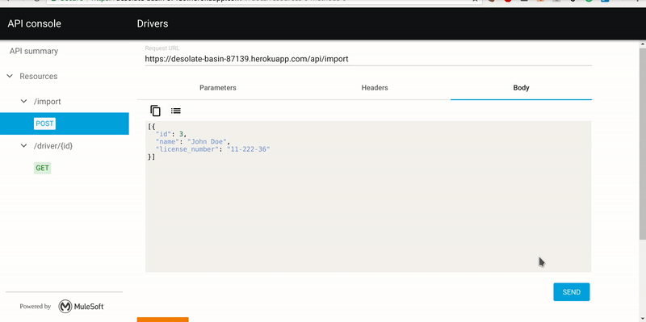
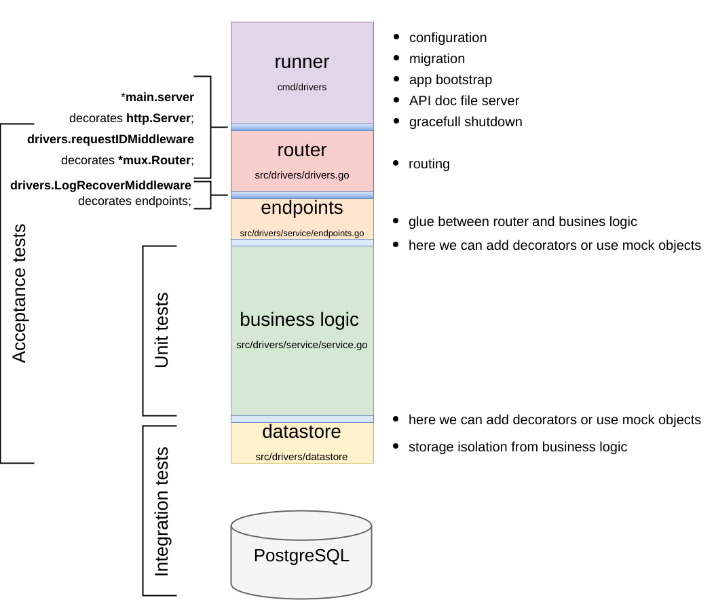

# Drivers (go-kit)
This is a go-kit powered micro-service, called Drivers. It serves REST-like API and an alive API documentation. It is available at https://desolate-basin-87139.herokuapp.com/.



API documentation allows you to easily play with the Drivers API in your browser.

# Requirements
* Go `>=1.8` (because of new context aware methods in database/sql pkg)
* PostgreSQL `>=9.5` (because of UPSERT)

# Installation
```
go get -u  github.com/konjoot/drivers-go-kit/...
```
# Usage

Ensure that you are in the project's root
```
cd $GOPATH/src/github.com/konjoot/drivers-go-kit/
```
Use `-h` to get help about flags

```
drivers -h
# Usage of drivers:
#  -db.pool_size int
#    	Number of idle connections allowed (default 16)
#  -db.url string
#    	DB connection URL (default "postgres://drivers@localhost/drivers_dev?sslmode=disable")
#  -http.addr string
#    	HTTP listen address (default ":8080")
```

Before service launch ensure that you created a user and a database. By default it is:
 `user: drivers`, `database: drivers_dev`.

```
createuser drivers -s # create a superuser drivers
createdb drivers_dev -O drivers
```
Now you can launch the service
```
drivers
# message="1 migration applied"
# message="HTTP-server is listening on :8080"
```
API should be available at http://localhos:8080/api/.

API documentation should be available at http://localhost:8080.

# Project goals

* do the code [challenge](challenge.md)
* write a self-instrumented micro-service
* dive into go-kit

# What is done?

* service with REST-like API which described in the assignment
* service instrumentation:
  * run required migrations on start
  * serve static files for the API documentation
  * structured, contextual logging
  * full context propagation
  * gracefull shutdown
* go-kit powered extensible architecture
* service documentation:
  * API documentation (RAML)
  * README.md
* deployment to Heroku

# Dependencies

## code:
* [go-kit](https://gokit.io/) for tooling and glue
* [gorilla/mux](https://github.com/gorilla/mux) for routing
* [rubenv/sql-migrate](https://github.com/rubenv/sql-migrate) for migrations
* [lib/pq](https://github.com/lib/pq) as a PostgreSQL database driver

## tools:
* [api-console](https://github.com/mulesoft/api-console) used to generate API documentation from .raml files

# Project structure

* [build](build) - generated directory with assets for API documentation
* [cmd/drivers](cmd/drivers) - application runner
* [src/drivers](src/drivers/) - application constructor and acceptance tests
* [src/drivers/datastore](src/drivers/datastore) - datastore layer and integration tests
* [src/drivers/migrations](src/drivers/migrations) - a directory with migrations
* [src/drivers/service](src/drivers/service) - business logic and unit tests

# Architecture



# Testing

There are three types of tests you can find in the app:
* acceptance tests - tests with fully constructed application with in-memory datastore
* unit tests - for testing a business logic in isolation
* integration tests - datastore tests with PostgreSQL server, the slowest of the three

Before running tests `go get -u github.com/google/uuid`

Run tests `go test ./src...`

# API documentation

To generate API documentation:
* ensure you have api-console installed `sudo npm install -g api-console-cli`
* run `api-console build ./src/drivers/api.raml --json` from the project's root